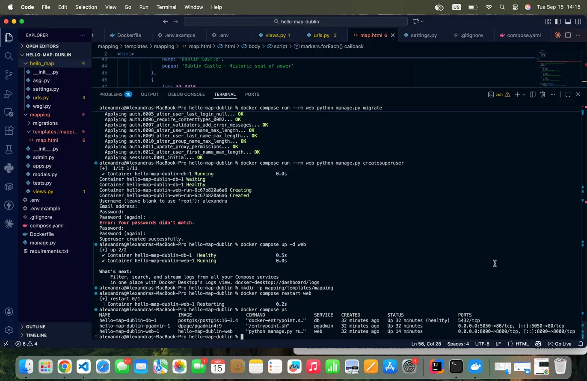
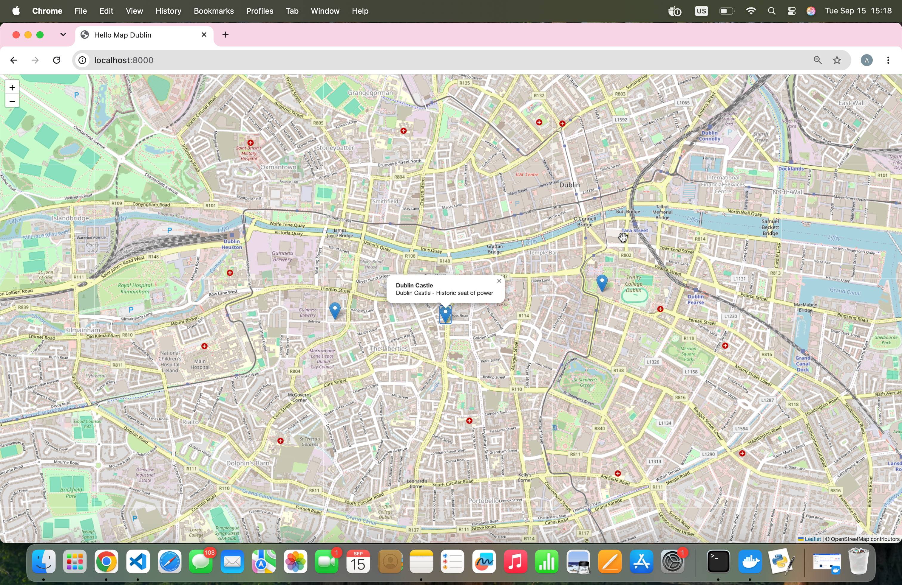
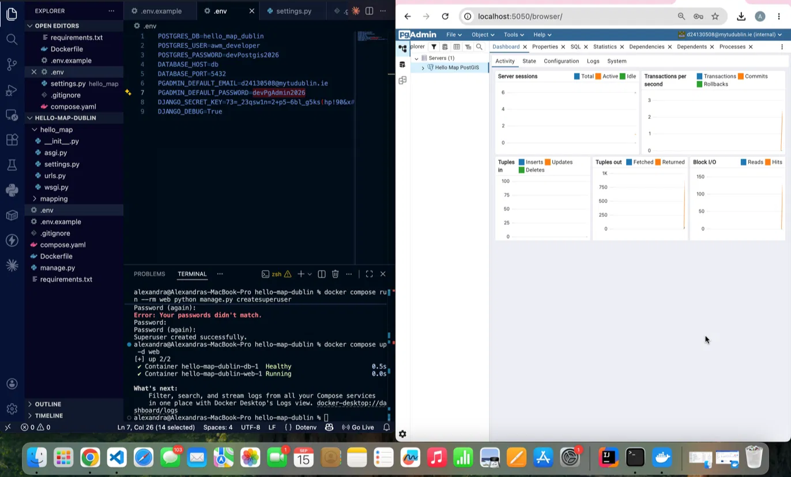
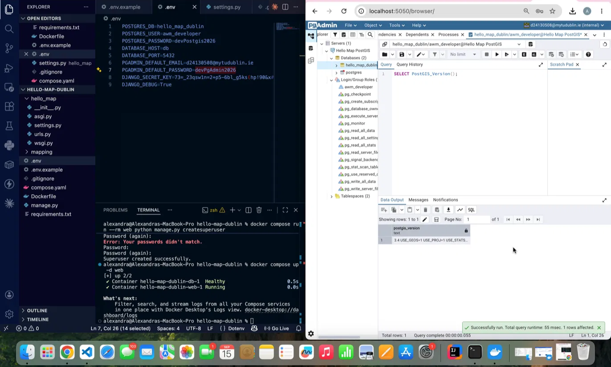
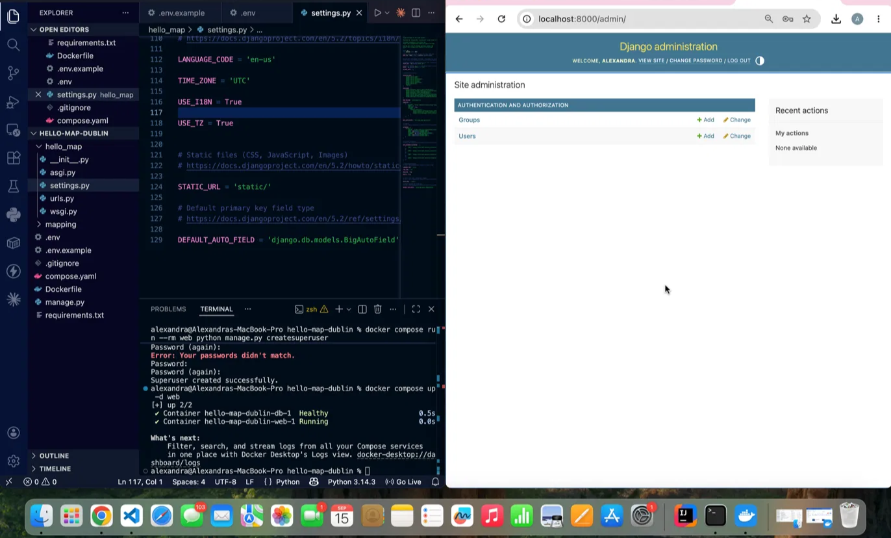

# Hello Map Dublin — Lab 1

## CMPU4058 - Advanced Web Mapping - Week 1

A containerised web mapping environment built with Django, PostGIS, and pgAdmin, serving an interactive Leaflet map centred on Dublin.

## Submission Evidence

### 1. Docker Compose services running with PostGIS health check passing

### 2. The Hello Map in the browser

### 3. pgAdmin connected to the Hello Map PostGIS server

### 4. Result of SELECT PostGIS_Version();

### 5. Django admin site logged in as administrator

## Setup

See `.env.example` for required environment variables. Copy to `.env` and fill in real values before running:

\`\`\`bash
docker compose up --build -d
docker compose run --rm web python manage.py migrate
docker compose run --rm web python manage.py createsuperuser
\`\`\`

Visit `http://localhost:8000/` for the map, `http://localhost:8000/admin/` for Django admin, and `http://localhost:5050` for pgAdmin.
