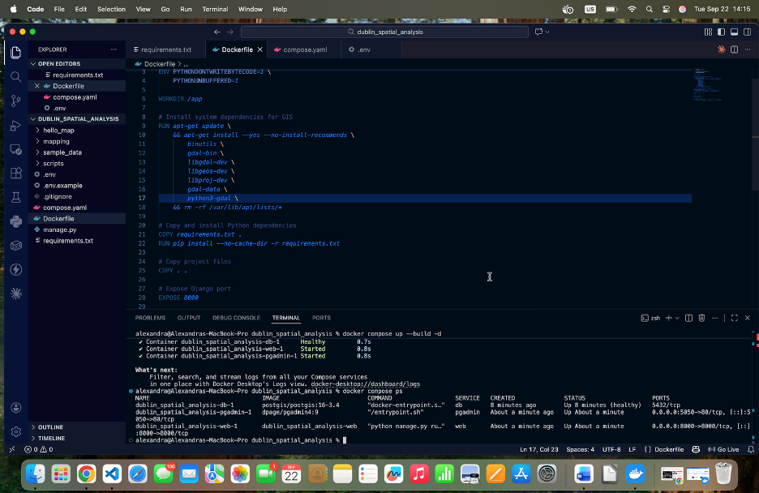
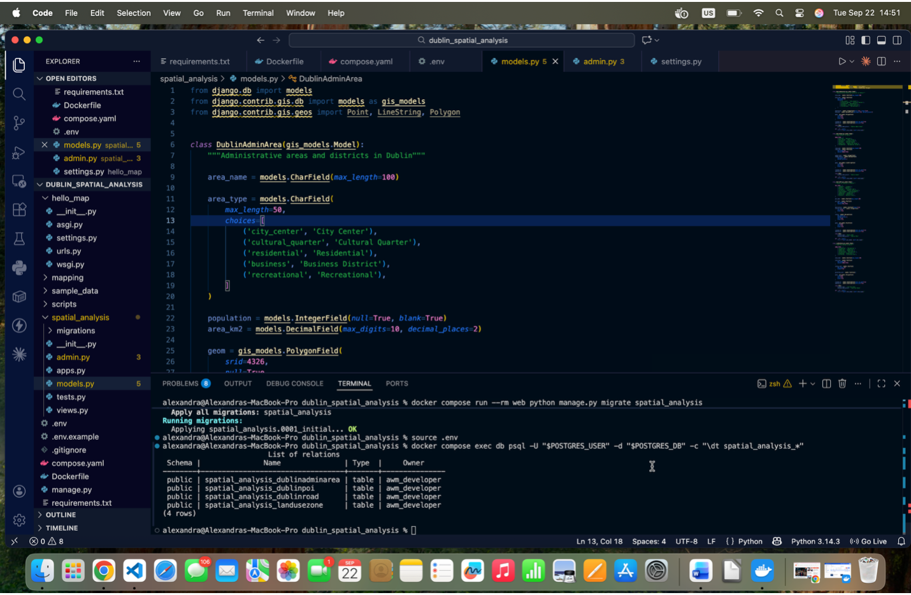
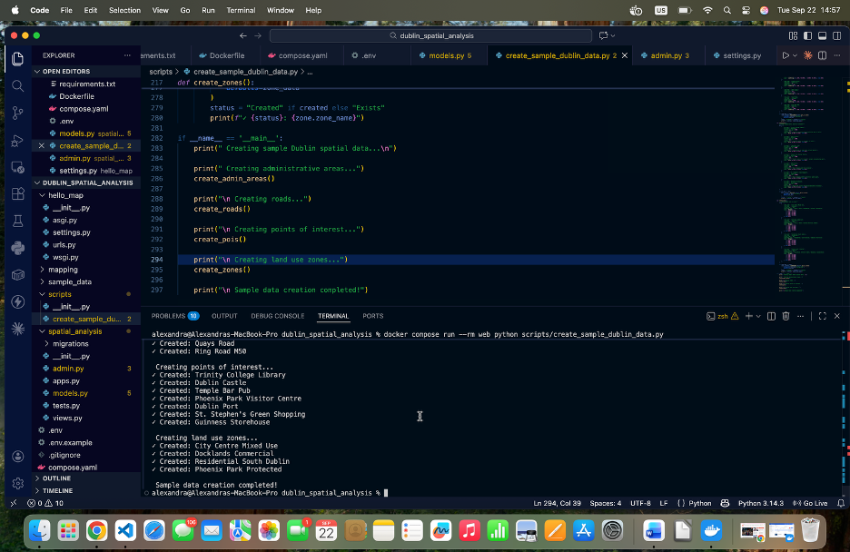
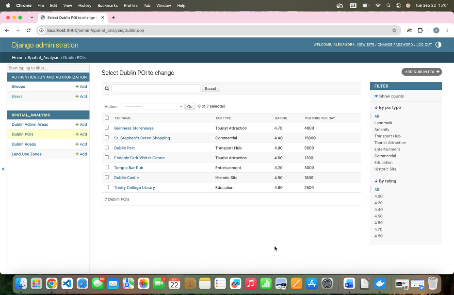
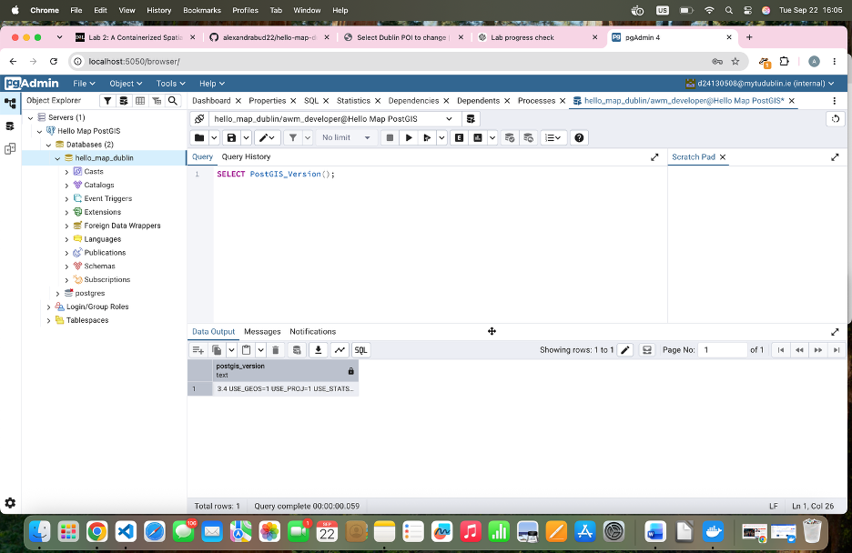
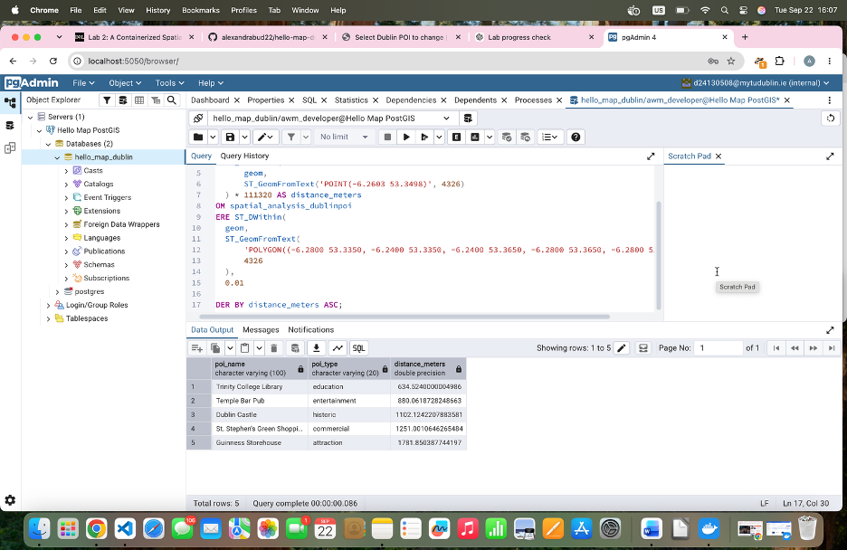
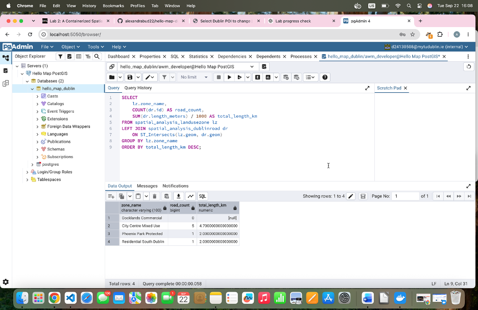
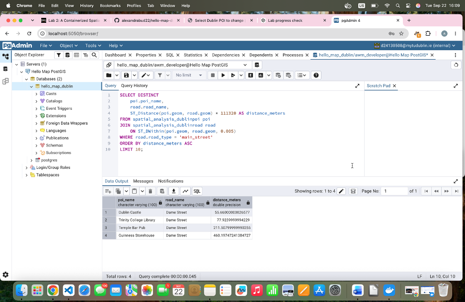

# Week 2 – Spatial Analysis with Django, GeoDjango and PostGIS

## Overview

Week 2 extended the Week 1 containerized Django mapping project with spatial-data storage and analysis.

The completed Week 1 project was copied into a new `dublin_spatial_analysis` project directory. This allowed the existing Django, Docker Compose and PostGIS configuration to be reused while preserving the original Week 1 work.

The main objectives of Week 2 were to:

- extend the Docker image with GIS tools
- create GeoDjango spatial models
- store spatial data in PostGIS
- populate the database with sample Dublin data
- perform spatial SQL queries
- create spatial-analysis Django views
- display spatial data through a web dashboard

---

## 1. Week 2 Project Setup

The completed Week 1 project was copied into a new Week 2 project.

New directories were created for:

- `sample_data`
- `scripts`

The `sample_data` directory was used for geographic datasets, while `scripts` contained Python scripts for creating and importing spatial data.

---

## 2. Additional GIS Dependencies

The Week 1 Python dependencies were extended with:

- Shapely
- GeoJSON

Shapely provides support for geometric operations in Python.

GeoJSON is used for representing and serializing geographic data.

GDAL was not installed through `requirements.txt` because it depends on system-level GIS libraries.

The Docker image was extended with:

- GDAL / OGR
- GEOS
- PROJ
- Python GDAL bindings

Installing these dependencies inside Docker keeps the project environment reproducible.

---

## 3. Docker Environment

The Docker Compose configuration from Week 1 was reused.

The environment contains:

- PostgreSQL with PostGIS
- pgAdmin
- Django web application

The Docker image was rebuilt successfully with the new GIS dependencies.

```bash
docker compose build
docker compose up -d
docker compose ps
```

`docker compose ps` confirmed that:

- the Django web service was running
- pgAdmin was running
- the PostGIS database was healthy



---

## 4. Django Database Migrations

When the Week 2 environment was first started, Django reported unapplied built-in migrations.

This occurred because the new Docker Compose project created a fresh PostGIS database volume.

The standard Django migrations were applied:

```bash
docker compose run --rm web python manage.py migrate
```

These migrations created the required:

- authentication tables
- administration tables
- content-type tables
- session tables

The web service was then restarted.

Django reported no system-check problems and successfully started on port `8000`.

A Django superuser account was also created to access the administration interface.

---

## 5. Creating the `spatial_analysis` Application

A new Django application named `spatial_analysis` was created.

```bash
docker compose run --rm web python manage.py startapp spatial_analysis
```

The application was designed to contain:

- GeoDjango models
- spatial admin configuration
- spatial views
- templates
- URL routes



---

## 6. GeoDjango Spatial Models

Four GeoDjango models were created to represent different types of Dublin spatial data.

### Administrative Areas

Administrative areas use polygon geometries.

### Roads

Roads use line geometries.

### Points of Interest

Points of interest use point geometries.

### Land-Use Zones

Land-use zones use polygon geometries.

All geometry fields use:

```text
SRID 4326
```

This corresponds to the WGS84 coordinate reference system.

Each model contains both descriptive attributes and a spatial geometry field.

GeoDjango integrates these fields directly with PostGIS, allowing spatial SQL and ORM queries.



---

## 7. Django Admin Configuration

The spatial models were registered in Django Admin using `GISModelAdmin`.

The administration interface was configured with:

- list displays
- filters
- search fields
- read-only timestamp fields

The `spatial_analysis` application was also added to `INSTALLED_APPS`.

---

## 8. Spatial Database Migrations

GeoDjango migrations were generated from the four spatial models.

```bash
docker compose run --rm web python manage.py makemigrations spatial_analysis
docker compose run --rm web python manage.py migrate
```

The PostGIS database was then inspected to verify that four new spatial tables had been created for:

- administrative areas
- roads
- points of interest
- land-use zones



---

## 9. Loading Sample Spatial Data

A sample-data initialization script was executed inside the Django container.

The script populated PostGIS with:

- administrative areas
- roads
- points of interest
- land-use zones

The imported point-of-interest data included Dublin locations such as:

- Trinity College Library
- Dublin Castle
- Temple Bar
- Phoenix Park Visitor Centre
- Dublin Port
- St. Stephen's Green Shopping
- Guinness Storehouse



---

## 10. Verifying Data in Django Admin

The imported spatial data was verified through Django Admin.

The Dublin POI table contained seven records.

The administration interface displayed information including:

- POI name
- POI type
- rating
- estimated visitors per day



---

## 11. Verifying PostGIS

PostGIS functionality was verified directly in pgAdmin.

The following query was executed:

```sql
SELECT PostGIS_Version();
```

The query returned the installed PostGIS version, confirming that spatial database functionality was available.



---

## 12. Spatial Query 1 – POIs Near Dublin City Centre

The first spatial query identified points of interest near the Dublin City Centre reference location.

The reference coordinates were:

```text
Longitude: -6.2603
Latitude: 53.3498
```

`ST_DWithin` was used to filter POIs based on spatial distance.

`ST_Distance` was used to calculate the approximate distance between each POI and the reference point.

The results were ordered from nearest to furthest.



---

## 13. Spatial Query 2 – Roads by Land-Use Zone

The second spatial query analysed road infrastructure within each land-use zone.

`ST_Intersects` was used to identify roads whose geometries intersected each land-use polygon.

The query then:

- counted intersecting roads
- summed their stored lengths in kilometres

The results showed that the City Centre Mixed Use zone contained the greatest amount of road infrastructure in the sample data.

The Docklands Commercial zone had no intersecting roads in the sample dataset.


---

## 14. Spatial Query 3 – POIs Near Main Streets

The third spatial query identified points of interest located near roads classified as `main_street`.

`ST_DWithin` was used to perform a spatial proximity join between:

- POIs
- roads

`ST_Distance` calculated the approximate separation between each POI and nearby road.

In the sample dataset, Dublin Castle was the closest POI to Dame Street.


---

## 15. Spatial Query 4 – Administrative Area Coverage

The fourth query produced a combined spatial analysis for each Dublin administrative area.

`ST_Contains` was used to count POIs located inside each administrative-area polygon.

`ST_Intersects` was used to identify roads crossing each area.

The results showed that Dublin City Centre contained the highest number of POIs in the sample dataset and also contained substantial road infrastructure.


---

## 16. Django Spatial Views

Two Django views were created for the `spatial_analysis` application.

### Spatial Analysis Dashboard

The dashboard retrieves information from PostGIS including:

- administrative areas
- roads
- points of interest
- land-use zones

### POI Detail View

The POI detail view retrieves an individual point of interest.

It also attempts to identify nearby roads using a GeoDjango spatial distance query.

---

## 17. URL Routing

The original Week 1 mapping application remained available at the root URL.

The Week 2 spatial-analysis application was made available under:

```text
/spatial/
```

Django configuration was checked using:

```bash
python manage.py check
```

No system-check errors were reported.

---

## 18. Spatial Analysis Dashboard

The spatial-analysis dashboard was successfully rendered through Django.

The dashboard displayed summary statistics for the spatial datasets:

- 5 administrative areas
- 5 roads
- 7 points of interest
- 4 land-use zones

It also displayed selected attractions and administrative-area information dynamically retrieved from PostGIS.


---

## 19. POI Detail Page

The POI detail page successfully displayed information for individual points of interest.

The page also listed nearby roads found using a GeoDjango spatial distance query.

For the Guinness Storehouse, nearby road features included:

- Dame Street
- M50 Ring Road


---

## 20. Final Validation

Final validation confirmed that:

- all Docker services were running
- the PostGIS database was healthy
- Django was serving the spatial-analysis pages
- the `spatial_analysis` migration had been applied
- GDAL was available inside the web container

The installed GDAL version was:

```text
GDAL 3.10.3
```

The Python GDAL binding was associated with the container's system Python installation rather than the `/usr/local` Python interpreter used by Django.


---

## Challenges Encountered and Solutions

### Fresh PostGIS Database

The Week 2 Docker Compose project created a new database volume.

Because of this, Django initially reported unapplied built-in migrations.

The issue was resolved by running:

```bash
python manage.py migrate
```

### GIS System Dependencies

GDAL could not simply be added as a normal Python dependency.

The required GIS system libraries were therefore installed through the Docker image.

This ensured that GDAL, GEOS and PROJ were available consistently inside the development environment.

### GDAL Python Binding

During final validation, GDAL was available inside the container, but the Python GDAL binding was associated with the system Python installation instead of the `/usr/local` Python environment used by Django.

The spatial application still functioned successfully because the required GeoDjango/PostGIS functionality was available.

---

## Technologies Used

- Python
- Django
- GeoDjango
- PostgreSQL
- PostGIS
- pgAdmin
- Docker
- Docker Compose
- GDAL / OGR
- GEOS
- PROJ
- Shapely
- GeoJSON
- HTML
- CSS

---

## Key Spatial Functions Used

The lab demonstrated several PostGIS spatial functions:

### `ST_DWithin`

Used to determine whether two geometries are within a specified distance.

### `ST_Distance`

Used to calculate the distance between spatial features.

### `ST_Intersects`

Used to determine whether two geometries intersect.

### `ST_Contains`

Used to determine whether one geometry contains another.

---

## Future Enhancements

Possible future improvements include:

- adding more Dublin spatial datasets
- importing real OpenStreetMap data
- creating interactive web maps for the analysis results
- adding more advanced spatial filters
- exposing the spatial data through a REST API
- adding GeoJSON endpoints
- improving spatial indexing
- adding automated spatial tests
- creating more advanced distance and proximity analysis

---

## Conclusion

Week 2 extended the Week 1 Django/PostGIS mapping application into a spatial-analysis application.

The completed project demonstrates:

- GeoDjango spatial models
- PostGIS spatial storage
- point, line and polygon geometries
- Django GIS administration
- spatial database queries
- proximity analysis
- intersection analysis
- containment analysis
- dynamic Django views
- spatial data displayed through a web dashboard

The project provides the spatial database and analysis foundation required for more advanced geographic web applications.