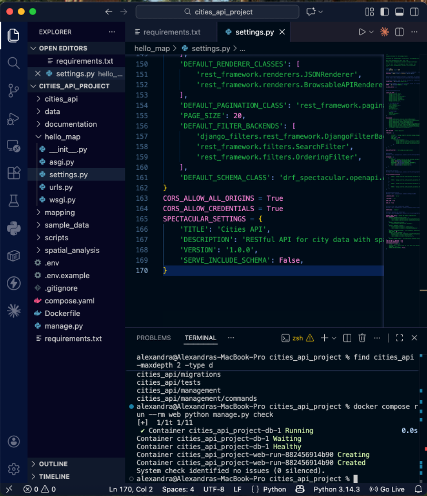
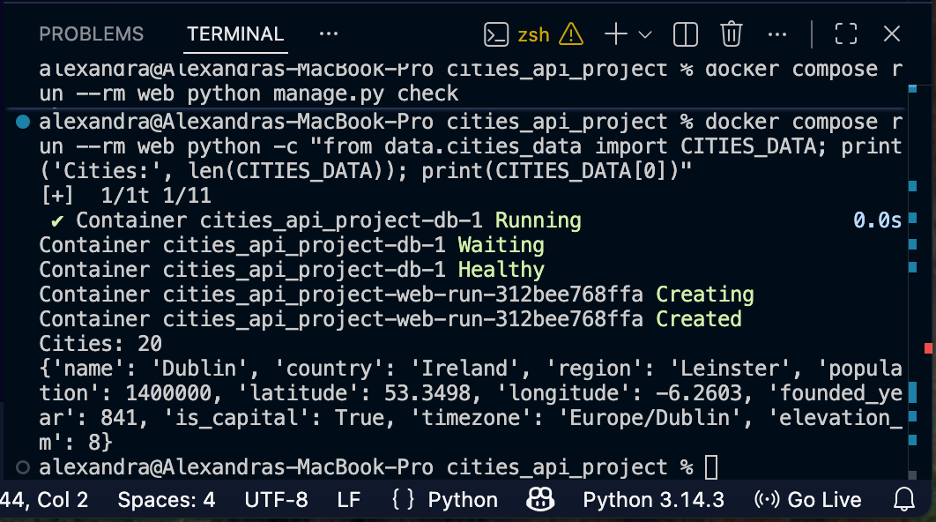
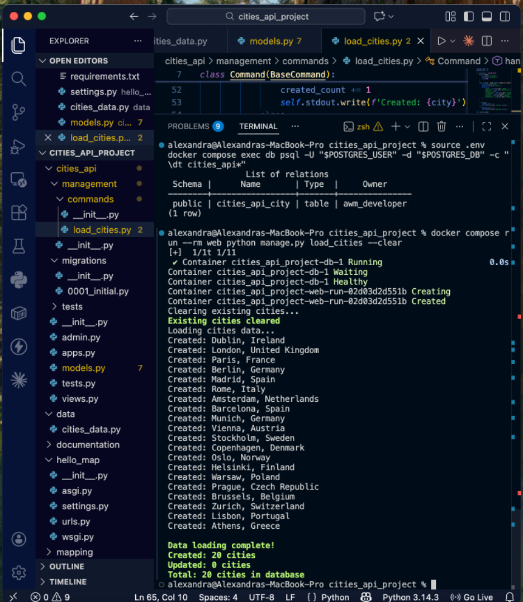
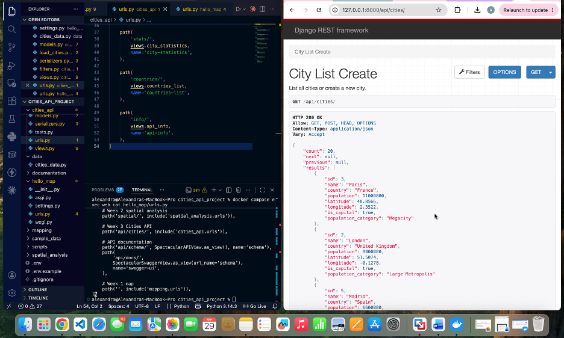
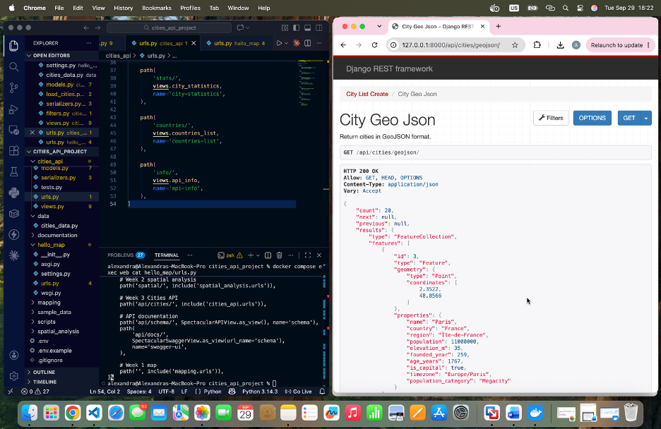
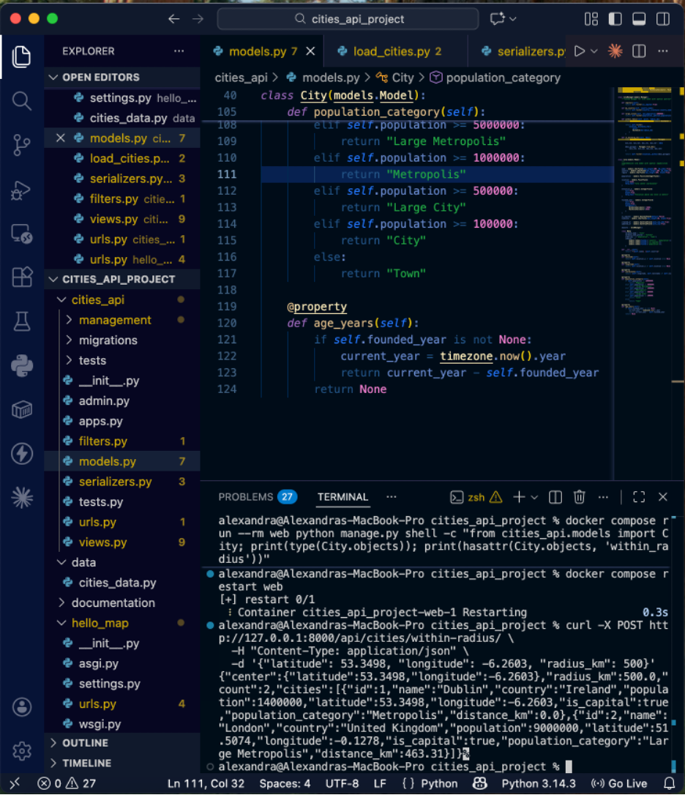
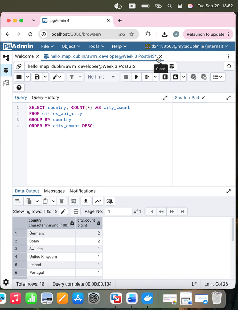
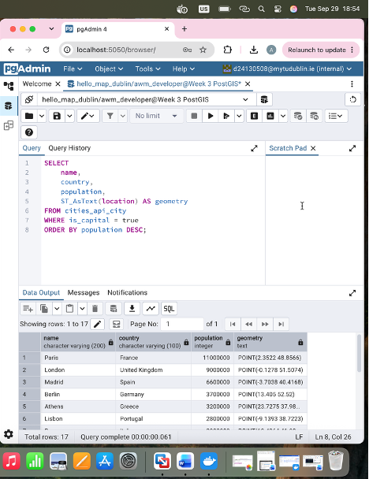
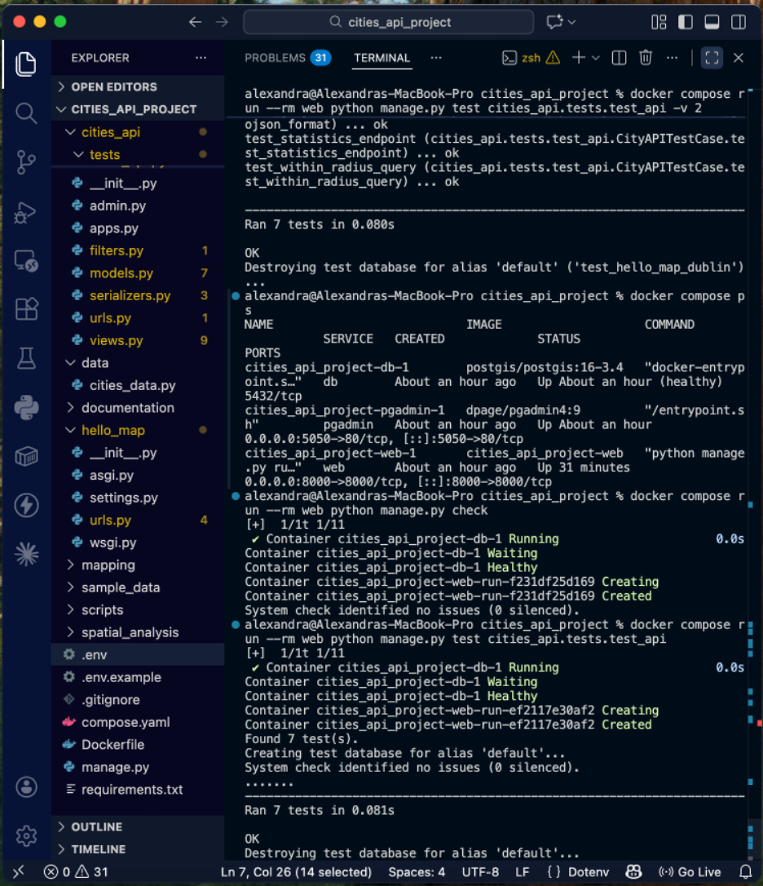

# Week 3 – Building a Cities API with Django and PostGIS

## Overview

The completed Week 2 containerized project was copied into a new `cities_api_project` directory for Week 3.

This preserved the existing Django, PostGIS, GeoDjango and Docker configuration while allowing the new REST API functionality to be developed independently.

---

## 1. Project Setup

The Week 3 project was created from the completed Week 2 project.

The copied project retained:

- Django
- GeoDjango
- PostgreSQL/PostGIS
- Docker Compose
- pgAdmin
- the Week 1 `mapping` application
- the Week 2 `spatial_analysis` application


---

## 2. Docker Environment

The copied Week 3 project was started using Docker Compose.

```bash
docker compose up -d
docker compose ps
```

`docker compose ps` confirmed that:

- the Django web service was running
- pgAdmin was running
- the PostGIS database was healthy


---

## 3. Creating the `cities_api` Application

A new Django application named `cities_api` was used for the Week 3 API.

Additional directories were created for:

- Django management commands
- automated API tests
- sample city data
- API documentation


---

## 4. REST API Dependencies

The Week 2 Python dependencies were extended with:

- Django REST Framework
- Django REST Framework GIS
- django-filter
- django-cors-headers
- drf-spectacular
- django-extensions
- requests
- pytest
- pytest-django
- factory-boy

The Docker image was rebuilt and the required REST API libraries were successfully imported inside the web container.


---

## 5. Django REST Framework Configuration

The Django configuration was extended with:

- `rest_framework`
- `rest_framework_gis`
- `django_filters`
- `corsheaders`
- `drf_spectacular`
- `cities_api`

REST Framework configuration was also added for:

- authentication
- permissions
- JSON output
- browsable API output
- pagination
- filtering
- searching
- ordering
- OpenAPI schema generation

Django configuration was verified successfully using:

```bash
docker compose run --rm web python manage.py check
```

The system reported:

```text
System check identified no issues (0 silenced).
```



---

## 6. Sample Cities Dataset

A sample dataset containing 20 European cities was created.

Each city contains:

- name
- country
- region
- population
- latitude
- longitude
- founding year
- capital status
- timezone
- elevation

The dataset was verified successfully inside the Docker container.



---

## 7. City Spatial Model

A new `City` model was created using GeoDjango.

City coordinates are stored using:

```python
models.PointField(srid=4326)
```

The model also contains:

- population
- country
- region
- elevation
- founding year
- capital status
- timezone

Database indexes and helper properties were added to support efficient API queries.

A migration was created and applied successfully to PostGIS.


---

## 8. Database Table Verification

The `cities_api_city` table was verified directly in PostgreSQL after the migration was applied.


---

## 9. Loading the City Dataset

A custom Django management command named `load_cities` was created.

The command converted latitude and longitude values into GeoDjango `Point` objects using SRID 4326 and inserted the records into PostGIS.

The command successfully loaded:

```text
Created: 20 cities
Updated: 0 cities
Total: 20 cities in database
```



---

## 10. API Serializers

Several serializers were created:

- `CityListSerializer`
- `CityDetailSerializer`
- `CityGeoJSONSerializer`
- `CityCreateSerializer`
- `CitySummarySerializer`
- `DistanceSerializer`
- `BoundingBoxSerializer`

A real `City` record was retrieved from the database and serialized successfully.


---

## 11. Cities API

The Cities API was exposed at:

```text
/api/cities/
```

The Django REST Framework browsable API returned HTTP 200 and displayed 20 city records from PostGIS using paginated JSON output.

Each result included information such as:

- city name
- country
- population
- latitude
- longitude
- capital status
- population category



---

## 12. Statistics Endpoint

A statistics endpoint was created at:

```text
/api/cities/stats/
```

It returned:

- total number of cities
- total population
- number of countries
- number of capital cities
- average population
- largest city
- smallest city


---

## 13. API Filtering

Filtering was tested using:

```text
/api/cities/?country=Ireland
```

The endpoint returned Dublin as the only matching city.


---

## 14. GeoJSON Endpoint

The GeoJSON endpoint was tested at:

```text
/api/cities/geojson/
```

The API returned the city dataset as a GeoJSON `FeatureCollection`.

Each city was represented as a `Point` geometry with descriptive properties.



---

## 15. Radius-Based Spatial Search

A radius search was tested using Dublin as the centre point:

```text
Latitude: 53.3498
Longitude: -6.2603
Radius: 500 km
```

The API returned:

- Dublin – 0.0 km
- London – 463.31 km

This confirmed that GeoDjango and PostGIS distance queries were working.



---

## 16. Bounding-Box Spatial Search

A bounding-box endpoint was tested using minimum and maximum latitude and longitude coordinates.

The API returned only cities whose PostGIS point geometry was located inside the supplied geographic extent.


---

## 17. Automated API Tests

Automated tests were created for:

- city creation
- detail retrieval
- filtering
- city listing
- GeoJSON output
- statistics
- radius-based spatial queries

The complete test suite passed successfully:

```text
Ran 7 tests
OK
```


---

## 18. Swagger / OpenAPI Documentation

API documentation was generated automatically using `drf-spectacular`.

Swagger UI was available at:

```text
/api/docs/
```

The documentation displayed endpoints for:

- city CRUD operations
- GeoJSON output
- statistics
- country summaries
- filtering
- radius searches
- bounding-box searches


---

## 19. PostGIS Verification – Cities by Country

The city data was verified directly in PostGIS.

```sql
SELECT country, COUNT(*) AS city_count
FROM cities_api_city
GROUP BY country
ORDER BY city_count DESC;
```



---

## 20. PostGIS Verification – Capital Cities

Capital cities and their spatial geometry were queried using:

```sql
SELECT
    name,
    country,
    population,
    ST_AsText(location) AS geometry
FROM cities_api_city
WHERE is_capital = true
ORDER BY population DESC;
```

The results confirmed that the city coordinates were stored as PostGIS `Point` geometries.



---

## 21. PostGIS Spatial Distance Query

A spatial query identified cities located within 1000 km of Dublin.

The results included:

- Dublin – 0.00 km
- London – 464.58 km
- Amsterdam – 759.09 km
- Brussels – 777.63 km
- Paris – 782.50 km


---

## 22. Final Validation

Final validation confirmed that:

- Docker services were running
- the PostGIS database was healthy
- Django reported no system-check issues
- the Cities API was accessible
- the spatial API endpoints were working
- Swagger documentation was available
- all seven automated tests passed



---

## 23. Challenges Encountered and Solutions

### Existing `cities_api` Application

When attempting to create `cities_api`, Django reported that the name conflicted with an existing Python module.

Inspection of the project showed that the application already existed, so the existing application was reused instead of creating another one.

### API URL Configuration

The `/api/cities/` endpoint initially returned a `404 Page Not Found` error because the Week 3 API routes had not been added correctly to the main project URL configuration.

The `hello_map/urls.py` file was corrected so that:

```python
path('api/cities/', include('cities_api.urls')),
```

was included in the main URL patterns.

The Django web container was then restarted and the API endpoint returned HTTP 200 successfully.

### Custom Spatial Manager

The radius-based spatial endpoint initially produced:

```text
AttributeError: 'Manager' object has no attribute 'within_radius'
```

The `City` model was using Django's default manager rather than the custom `CityManager`.

The model was updated to use:

```python
objects = CityManager()
```

After this change, the custom spatial methods became available and the radius query worked correctly.

### GeoJSON Automated Test

The GeoJSON automated test initially failed because the GeoJSON response was wrapped inside the standard paginated REST response.

Pagination was disabled for the GeoJSON endpoint using:

```python
pagination_class = None
```

This allowed the endpoint to return a standard GeoJSON `FeatureCollection`.

After the correction, all seven automated tests passed successfully.

---

## 24. API Usage Examples

### List All Cities

```http
GET /api/cities/
```

This returns the paginated city dataset.

### Filter by Country

```http
GET /api/cities/?country=Ireland
```

This returns Dublin as the matching city.

### City Statistics

```http
GET /api/cities/stats/
```

This returns summary statistics for the complete city dataset.

### GeoJSON Output

```http
GET /api/cities/geojson/
```

This returns the city dataset as a GeoJSON `FeatureCollection`.

### Radius Search

```http
POST /api/cities/within-radius/
```

Example request body:

```json
{
  "latitude": 53.3498,
  "longitude": -6.2603,
  "radius_km": 500
}
```

The request returned Dublin and London.

### Bounding-Box Search

```http
POST /api/cities/bbox/
```

Example request body:

```json
{
  "min_longitude": -10,
  "min_latitude": 35,
  "max_longitude": 20,
  "max_latitude": 60
}
```

This returns cities whose PostGIS point geometry falls inside the specified geographic extent.

---

## 25. Performance and Validation

The API and spatial database were tested inside the Docker Compose development environment.

The following checks were completed:

- the PostGIS database reported a healthy status
- the Django web service was running successfully
- pgAdmin was available
- Django reported no system-check issues
- 20 city records were loaded into the database
- spatial API queries returned valid results
- all seven automated API tests passed

The automated test suite completed seven tests in approximately 0.08 seconds.

The PostGIS spatial query used to identify cities within 1000 km of Dublin completed in approximately 0.1 seconds on the sample dataset.

These values were measured using a small development dataset and should not be considered production-scale performance benchmarks.

---

## 26. Future Enhancements

Possible future improvements include:

- token-based API authentication
- API rate limiting
- caching for frequently requested data
- additional spatial indexes and query optimisation
- climate and economic city data
- historical population data
- relationships between cities
- integration with external geographic APIs
- WebSocket support for real-time updates
- a frontend web map consuming the GeoJSON API

---

## Conclusion

Week 3 extended the Week 2 spatial Django project into a RESTful Cities API.

The completed application demonstrates:

- Django REST Framework
- GeoDjango spatial models
- PostGIS spatial storage
- JSON and GeoJSON output
- filtering and pagination
- spatial radius queries
- bounding-box queries
- automated testing
- Swagger/OpenAPI documentation
- direct PostGIS analysis through pgAdmin

The final result is a reproducible containerized spatial API capable of serving geographic city information to web clients, mobile applications and other services.