# Week 3 – Building a Cities API with Django and PostGIS

## Overview

The completed Week 2 containerized project was copied into a new `cities_api_project` directory for Week 3.

This preserved the existing Django, PostGIS, GeoDjango and Docker configuration while allowing the new REST API functionality to be developed independently.

---

## 1. Project Setup

The Week 3 project was created from the completed Week 2 project.

The copied project retained:

- Django
- GeoDjango
- PostgreSQL/PostGIS
- Docker Compose
- pgAdmin
- the Week 1 `mapping` application
- the Week 2 `spatial_analysis` application

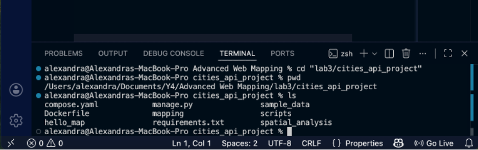

---

## 2. Docker Environment

The copied Week 3 project was started using Docker Compose.

```bash
docker compose up -d
docker compose ps
```

`docker compose ps` confirmed that:

- the Django web service was running
- pgAdmin was running
- the PostGIS database was healthy

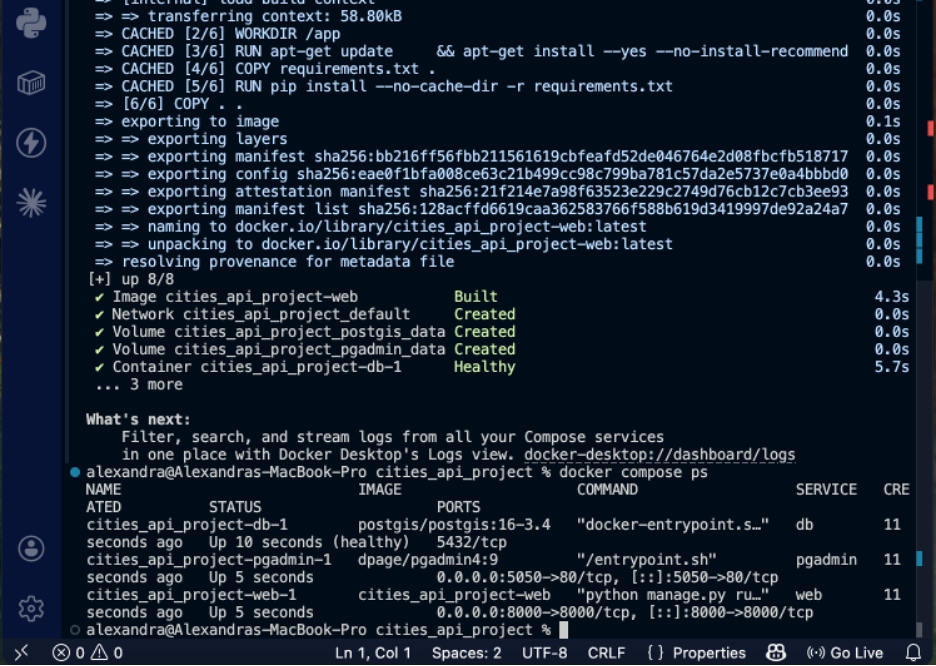

---

## 3. Creating the `cities_api` Application

A new Django application named `cities_api` was used for the Week 3 API.

Additional directories were created for:

- Django management commands
- automated API tests
- sample city data
- API documentation

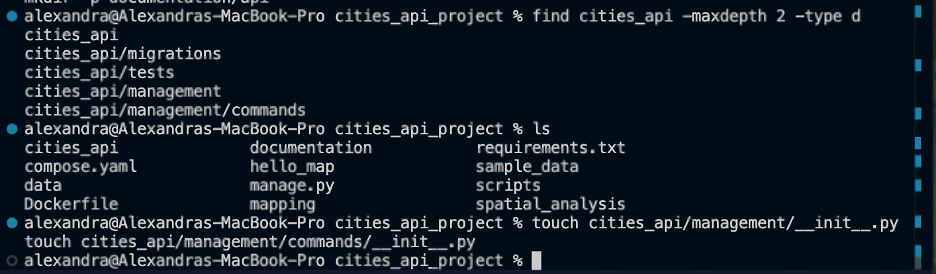

---

## 4. REST API Dependencies

The Week 2 Python dependencies were extended with:

- Django REST Framework
- Django REST Framework GIS
- django-filter
- django-cors-headers
- drf-spectacular
- django-extensions
- requests
- pytest
- pytest-django
- factory-boy

The Docker image was rebuilt and the required REST API libraries were successfully imported inside the web container.

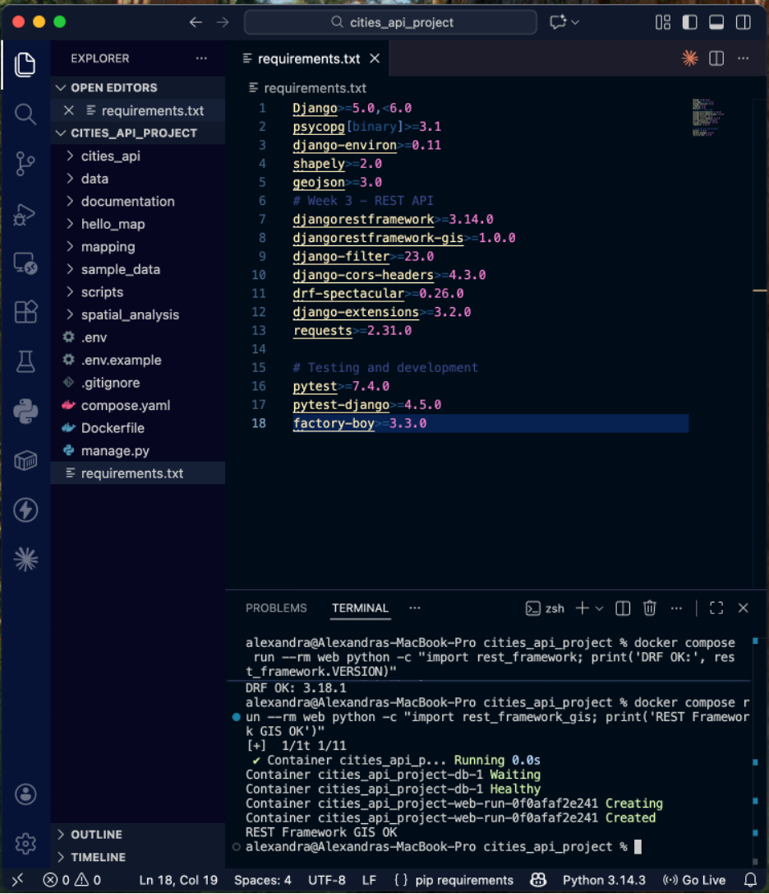

---

## 5. Django REST Framework Configuration

The Django configuration was extended with:

- `rest_framework`
- `rest_framework_gis`
- `django_filters`
- `corsheaders`
- `drf_spectacular`
- `cities_api`

REST Framework configuration was also added for:

- authentication
- permissions
- JSON output
- browsable API output
- pagination
- filtering
- searching
- ordering
- OpenAPI schema generation

Django configuration was verified successfully using:

```bash
docker compose run --rm web python manage.py check
```

The system reported:

```text
System check identified no issues (0 silenced).
```


---

## 6. Sample Cities Dataset

A sample dataset containing 20 European cities was created.

Each city contains:

- name
- country
- region
- population
- latitude
- longitude
- founding year
- capital status
- timezone
- elevation

The dataset was verified successfully inside the Docker container.


---

## 7. City Spatial Model

A new `City` model was created using GeoDjango.

City coordinates are stored using:

```python
models.PointField(srid=4326)
```

The model also contains:

- population
- country
- region
- elevation
- founding year
- capital status
- timezone

Database indexes and helper properties were added to support efficient API queries.

A migration was created and applied successfully to PostGIS.

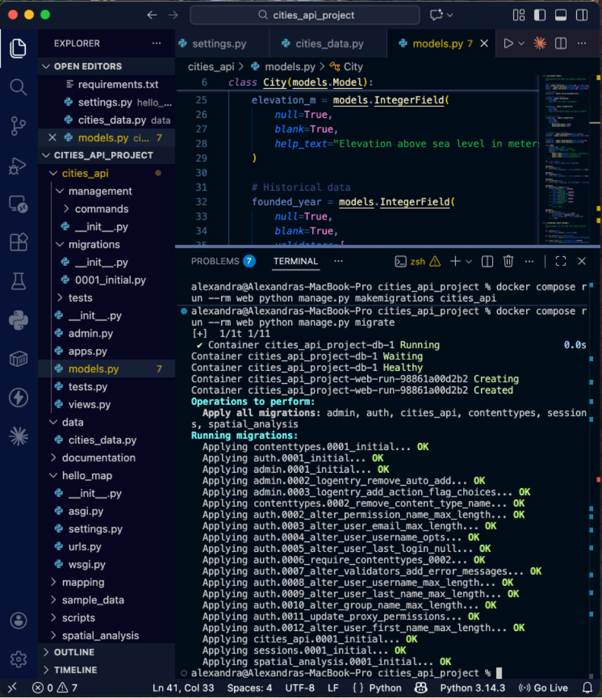

---

## 8. Database Table Verification

The `cities_api_city` table was verified directly in PostgreSQL after the migration was applied.

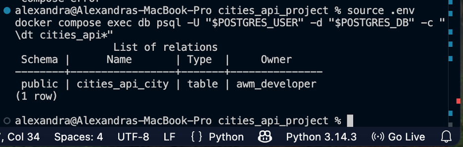

---

## 9. Loading the City Dataset

A custom Django management command named `load_cities` was created.

The command converted latitude and longitude values into GeoDjango `Point` objects using SRID 4326 and inserted the records into PostGIS.

The command successfully loaded:

```text
Created: 20 cities
Updated: 0 cities
Total: 20 cities in database
```


---

## 10. API Serializers

Several serializers were created:

- `CityListSerializer`
- `CityDetailSerializer`
- `CityGeoJSONSerializer`
- `CityCreateSerializer`
- `CitySummarySerializer`
- `DistanceSerializer`
- `BoundingBoxSerializer`

A real `City` record was retrieved from the database and serialized successfully.

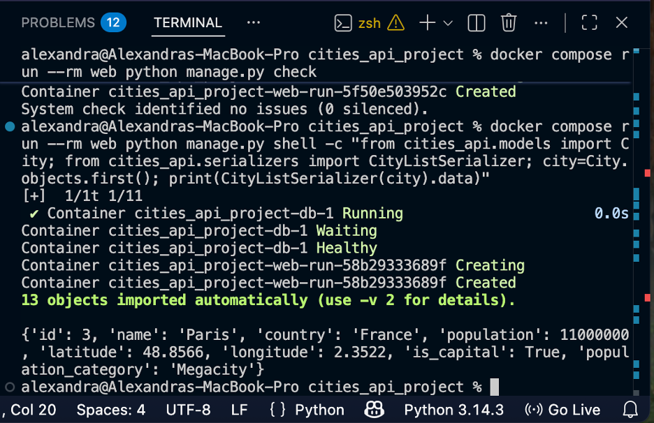

---

## 11. Cities API

The Cities API was exposed at:

```text
/api/cities/
```

The Django REST Framework browsable API returned HTTP 200 and displayed 20 city records from PostGIS using paginated JSON output.

Each result included information such as:

- city name
- country
- population
- latitude
- longitude
- capital status
- population category


---

## 12. Statistics Endpoint

A statistics endpoint was created at:

```text
/api/cities/stats/
```

It returned:

- total number of cities
- total population
- number of countries
- number of capital cities
- average population
- largest city
- smallest city

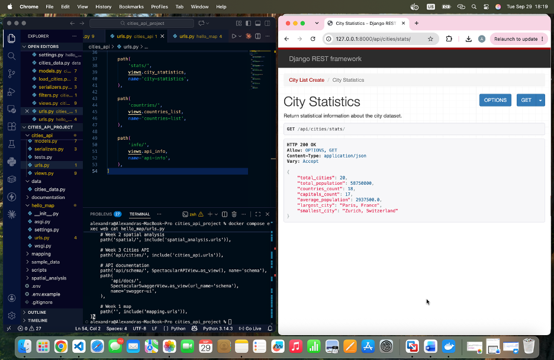

---

## 13. API Filtering

Filtering was tested using:

```text
/api/cities/?country=Ireland
```

The endpoint returned Dublin as the only matching city.

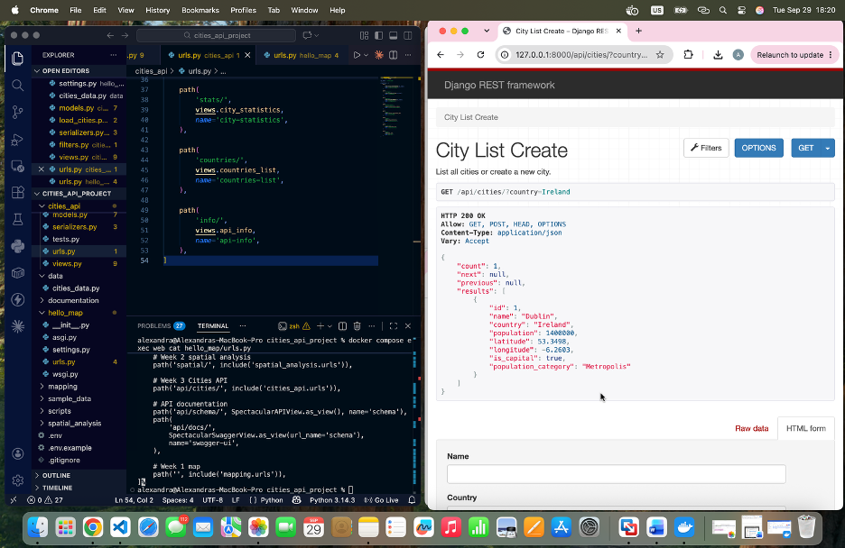

---

## 14. GeoJSON Endpoint

The GeoJSON endpoint was tested at:

```text
/api/cities/geojson/
```

The API returned the city dataset as a GeoJSON `FeatureCollection`.

Each city was represented as a `Point` geometry with descriptive properties.


---

## 15. Radius-Based Spatial Search

A radius search was tested using Dublin as the centre point:

```text
Latitude: 53.3498
Longitude: -6.2603
Radius: 500 km
```

The API returned:

- Dublin – 0.0 km
- London – 463.31 km

This confirmed that GeoDjango and PostGIS distance queries were working.


---

## 16. Bounding-Box Spatial Search

A bounding-box endpoint was tested using minimum and maximum latitude and longitude coordinates.

The API returned only cities whose PostGIS point geometry was located inside the supplied geographic extent.

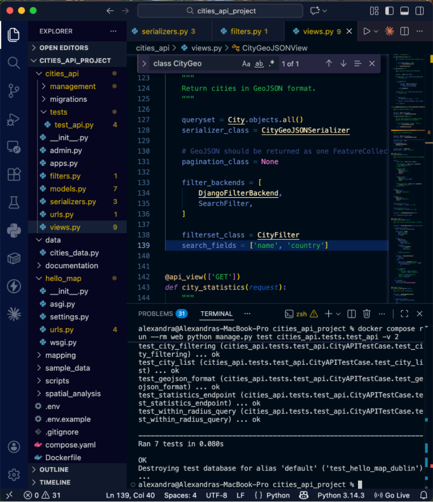

---

## 17. Automated API Tests

Automated tests were created for:

- city creation
- detail retrieval
- filtering
- city listing
- GeoJSON output
- statistics
- radius-based spatial queries

The complete test suite passed successfully:

```text
Ran 7 tests
OK
```

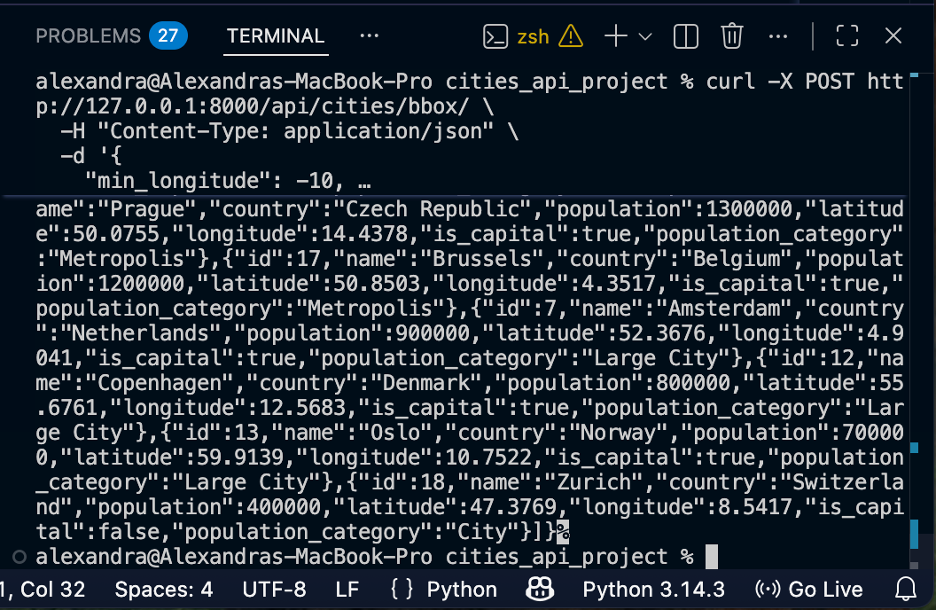

---

## 18. Swagger / OpenAPI Documentation

API documentation was generated automatically using `drf-spectacular`.

Swagger UI was available at:

```text
/api/docs/
```

The documentation displayed endpoints for:

- city CRUD operations
- GeoJSON output
- statistics
- country summaries
- filtering
- radius searches
- bounding-box searches

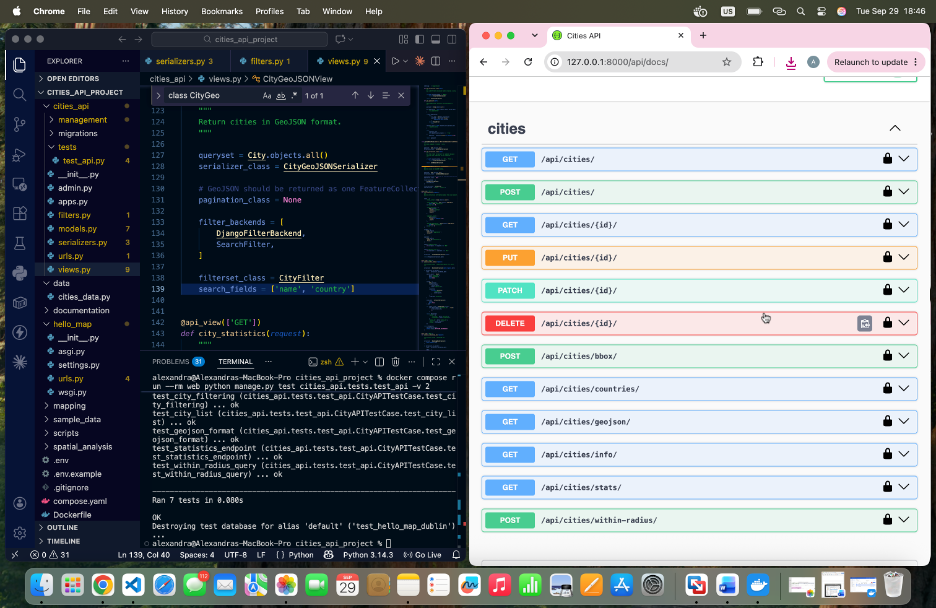

---

## 19. PostGIS Verification – Cities by Country

The city data was verified directly in PostGIS.

```sql
SELECT country, COUNT(*) AS city_count
FROM cities_api_city
GROUP BY country
ORDER BY city_count DESC;
```


---

## 20. PostGIS Verification – Capital Cities

Capital cities and their spatial geometry were queried using:

```sql
SELECT
    name,
    country,
    population,
    ST_AsText(location) AS geometry
FROM cities_api_city
WHERE is_capital = true
ORDER BY population DESC;
```

The results confirmed that the city coordinates were stored as PostGIS `Point` geometries.


---

## 21. PostGIS Spatial Distance Query

A spatial query identified cities located within 1000 km of Dublin.

The results included:

- Dublin – 0.00 km
- London – 464.58 km
- Amsterdam – 759.09 km
- Brussels – 777.63 km
- Paris – 782.50 km

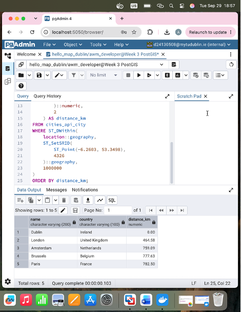

---

## 22. Final Validation

Final validation confirmed that:

- Docker services were running
- the PostGIS database was healthy
- Django reported no system-check issues
- the Cities API was accessible
- the spatial API endpoints were working
- Swagger documentation was available
- all seven automated tests passed


---

## 23. Challenges Encountered and Solutions

### Existing `cities_api` Application

When attempting to create `cities_api`, Django reported that the name conflicted with an existing Python module.

Inspection of the project showed that the application already existed, so the existing application was reused instead of creating another one.

### API URL Configuration

The `/api/cities/` endpoint initially returned a `404 Page Not Found` error because the Week 3 API routes had not been added correctly to the main project URL configuration.

The `hello_map/urls.py` file was corrected so that:

```python
path('api/cities/', include('cities_api.urls')),
```

was included in the main URL patterns.

The Django web container was then restarted and the API endpoint returned HTTP 200 successfully.

### Custom Spatial Manager

The radius-based spatial endpoint initially produced:

```text
AttributeError: 'Manager' object has no attribute 'within_radius'
```

The `City` model was using Django's default manager rather than the custom `CityManager`.

The model was updated to use:

```python
objects = CityManager()
```

After this change, the custom spatial methods became available and the radius query worked correctly.

### GeoJSON Automated Test

The GeoJSON automated test initially failed because the GeoJSON response was wrapped inside the standard paginated REST response.

Pagination was disabled for the GeoJSON endpoint using:

```python
pagination_class = None
```

This allowed the endpoint to return a standard GeoJSON `FeatureCollection`.

After the correction, all seven automated tests passed successfully.

---

## 24. API Usage Examples

### List All Cities

```http
GET /api/cities/
```

This returns the paginated city dataset.

### Filter by Country

```http
GET /api/cities/?country=Ireland
```

This returns Dublin as the matching city.

### City Statistics

```http
GET /api/cities/stats/
```

This returns summary statistics for the complete city dataset.

### GeoJSON Output

```http
GET /api/cities/geojson/
```

This returns the city dataset as a GeoJSON `FeatureCollection`.

### Radius Search

```http
POST /api/cities/within-radius/
```

Example request body:

```json
{
  "latitude": 53.3498,
  "longitude": -6.2603,
  "radius_km": 500
}
```

The request returned Dublin and London.

### Bounding-Box Search

```http
POST /api/cities/bbox/
```

Example request body:

```json
{
  "min_longitude": -10,
  "min_latitude": 35,
  "max_longitude": 20,
  "max_latitude": 60
}
```

This returns cities whose PostGIS point geometry falls inside the specified geographic extent.

---

## 25. Performance and Validation

The API and spatial database were tested inside the Docker Compose development environment.

The following checks were completed:

- the PostGIS database reported a healthy status
- the Django web service was running successfully
- pgAdmin was available
- Django reported no system-check issues
- 20 city records were loaded into the database
- spatial API queries returned valid results
- all seven automated API tests passed

The automated test suite completed seven tests in approximately 0.08 seconds.

The PostGIS spatial query used to identify cities within 1000 km of Dublin completed in approximately 0.1 seconds on the sample dataset.

These values were measured using a small development dataset and should not be considered production-scale performance benchmarks.

---

## 26. Future Enhancements

Possible future improvements include:

- token-based API authentication
- API rate limiting
- caching for frequently requested data
- additional spatial indexes and query optimisation
- climate and economic city data
- historical population data
- relationships between cities
- integration with external geographic APIs
- WebSocket support for real-time updates
- a frontend web map consuming the GeoJSON API

---

## Conclusion

Week 3 extended the Week 2 spatial Django project into a RESTful Cities API.

The completed application demonstrates:

- Django REST Framework
- GeoDjango spatial models
- PostGIS spatial storage
- JSON and GeoJSON output
- filtering and pagination
- spatial radius queries
- bounding-box queries
- automated testing
- Swagger/OpenAPI documentation
- direct PostGIS analysis through pgAdmin

The final result is a reproducible containerized spatial API capable of serving geographic city information to web clients, mobile applications and other services.

# Week 4 – Django-Leaflet Integration: Interactive Web Maps

## Overview

Week 4 extends the Week 3 Cities API by adding an interactive Leaflet.js frontend.

The Week 3 Django, PostGIS and REST API environment was reused and extended with:

- Leaflet.js
- Django templates
- static JavaScript and CSS files
- AJAX requests using the Fetch API
- interactive city markers
- marker popups
- city search
- map reset functionality
- responsive design
- frontend functional tests

The final result is a full-stack web mapping application where the Django REST API provides city data and Leaflet displays that data interactively in the browser.

---

## 1. Week 4 Project Setup

The completed Week 3 project was copied into a new `week4` directory.

This preserved the existing:

- Django project
- PostGIS database configuration
- Docker Compose environment
- Week 1 mapping application
- Week 2 spatial analysis application
- Week 3 Cities REST API

The Week 4 project was then used as the development environment for the Leaflet frontend.

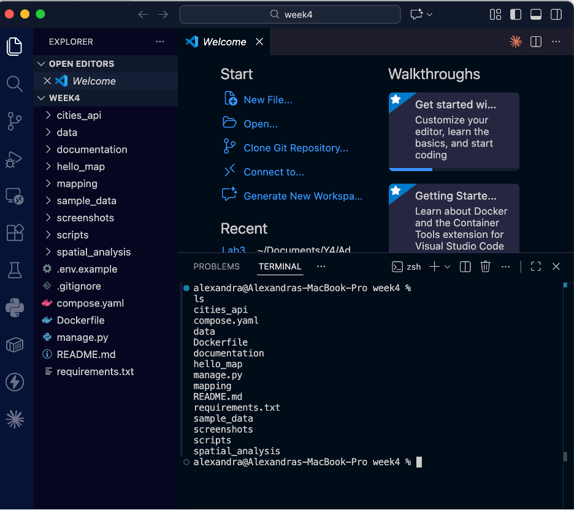

---

## 2. Docker Environment

The Week 4 Docker environment was started using Docker Compose.

```bash
docker compose up -d
docker compose ps
```

The environment contains:

- Django web service
- PostgreSQL/PostGIS database
- pgAdmin

The database health check confirmed that PostGIS was running successfully.

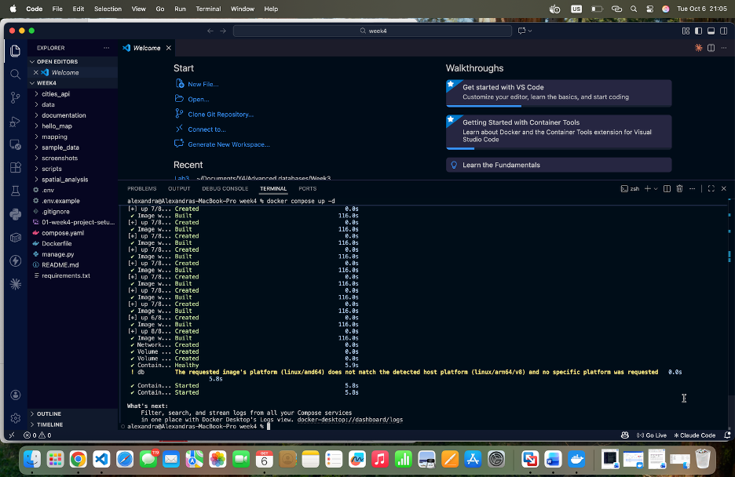

---

## 3. Frontend Project Structure

New frontend directories were created for the Week 4 mapping interface:

```text
static/
├── css/
│   └── styles.css
├── images/
└── js/
    └── map.js

templates/
└── map.html
```

The `templates` directory stores the Django map template.

The `static` directory stores the JavaScript, CSS and image assets used by the Leaflet frontend.

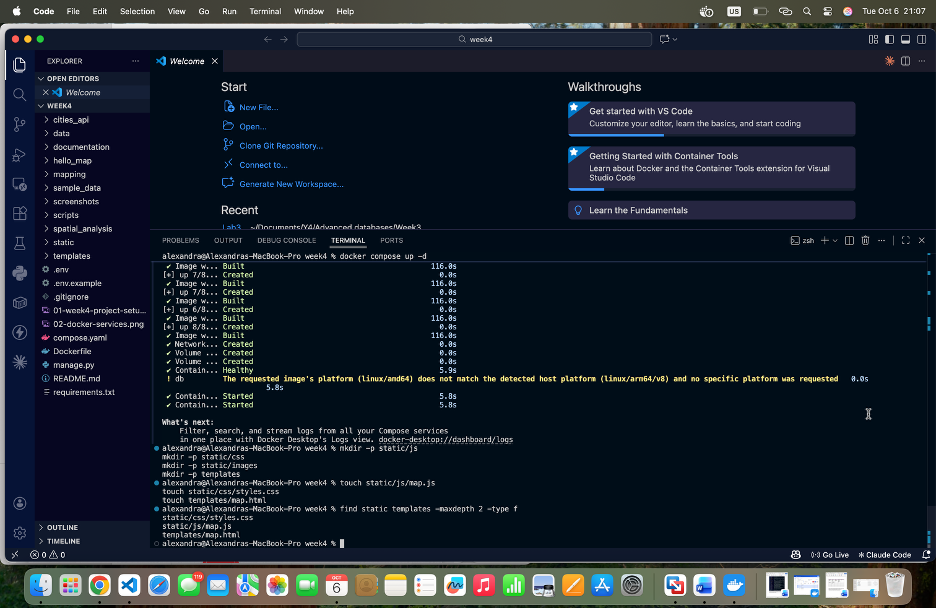

---

## 4. Django Static File Configuration

The Django settings were updated to support project-level templates and static files.

The following static configuration was added:

```python
STATIC_URL = "/static/"

STATIC_ROOT = BASE_DIR / "staticfiles"

STATICFILES_DIRS = [
    BASE_DIR / "static",
]
```

The template configuration was updated so Django could locate:

```text
templates/map.html
```

using:

```python
"DIRS": [
    BASE_DIR / "templates",
],
```

CORS support was also retained so the frontend and REST API could communicate correctly during development.

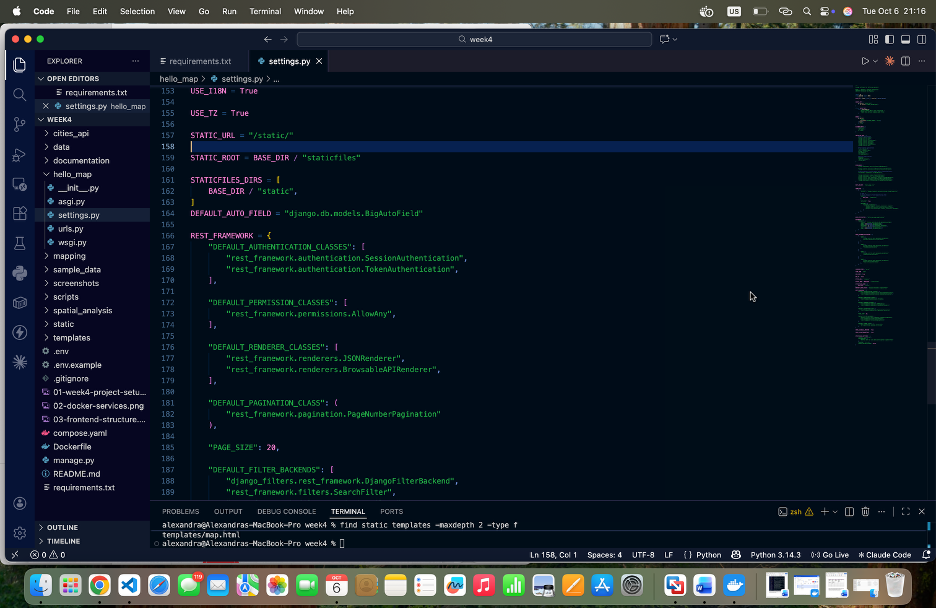

---

## 5. Map URL Configuration

The main Django URL configuration was extended with a new route for the Leaflet map.

The Week 3 API routes and previous lab routes were preserved.

The Week 4 route was added using Django's `TemplateView`:

```python
path(
    'map/',
    TemplateView.as_view(template_name='map.html'),
    name='map'
),
```

The interactive map therefore became available at:

```text
http://localhost:8000/map/
```

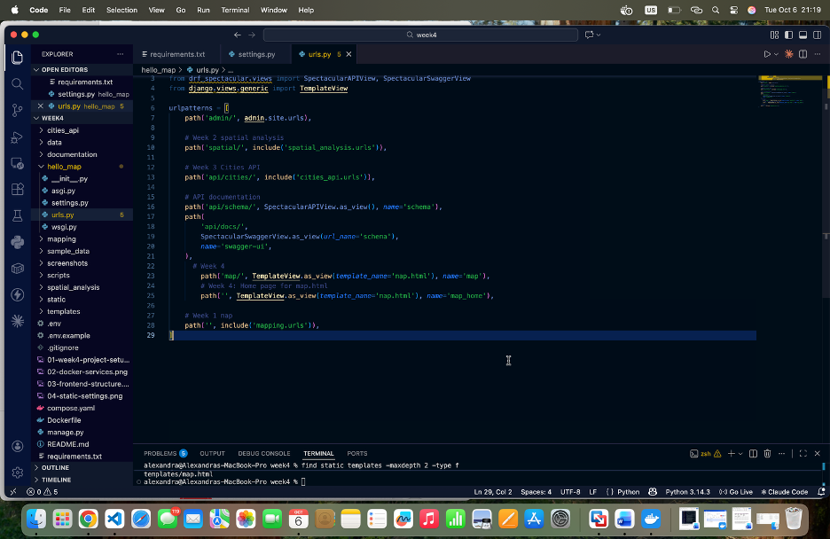

---

## 6. Django Configuration Check

The Django project configuration was checked using:

```bash
docker compose run --rm web python manage.py check
```

The result was:

```text
System check identified no issues (0 silenced).
```

This confirmed that the Week 4 settings and URL configuration were valid.

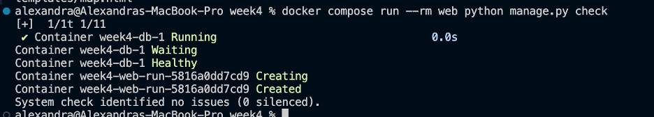

---

## 7. Leaflet Map Template

A new Django template was created at:

```text
templates/map.html
```

The template contains:

- a Leaflet map container
- a city search input
- a Reset View button
- a search results area
- a city information box
- a loading message
- Leaflet CSS and JavaScript
- custom Week 4 CSS and JavaScript

Leaflet is loaded through a CDN, while the Week 4 application logic is loaded from Django static files.

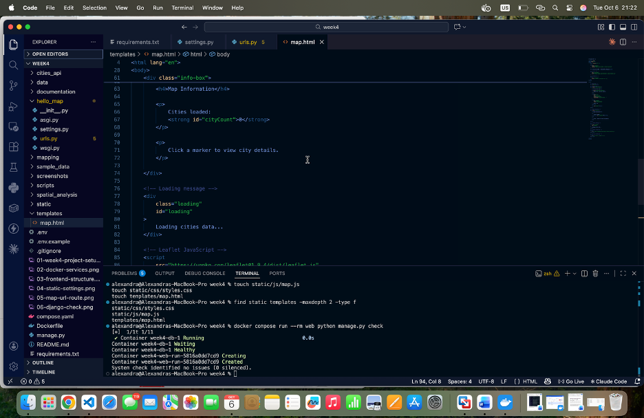

---

## 8. Custom Map Styling

A custom stylesheet was created at:

```text
static/css/styles.css
```

The stylesheet provides styling for:

- the full-screen map
- the search panel
- search input
- Reset View button
- search results
- city popups
- map information box
- loading indicator
- responsive mobile layout

A media query was added so the interface remains usable on smaller screens.

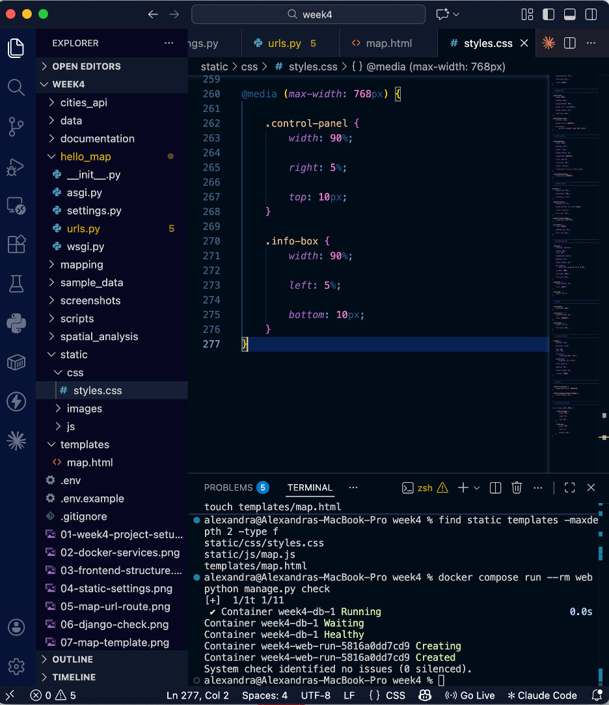

---

## 9. Leaflet JavaScript Logic

The main map functionality was implemented in:

```text
static/js/map.js
```

The JavaScript is responsible for:

- initializing the Leaflet map
- loading a basemap
- fetching city data from the REST API
- creating city markers
- creating city popups
- filtering cities
- navigating to selected cities
- resetting the map
- updating the city count
- displaying loading state information

The existing Week 3 API endpoint was used:

```javascript
const API_URL = "/api/cities/";
```

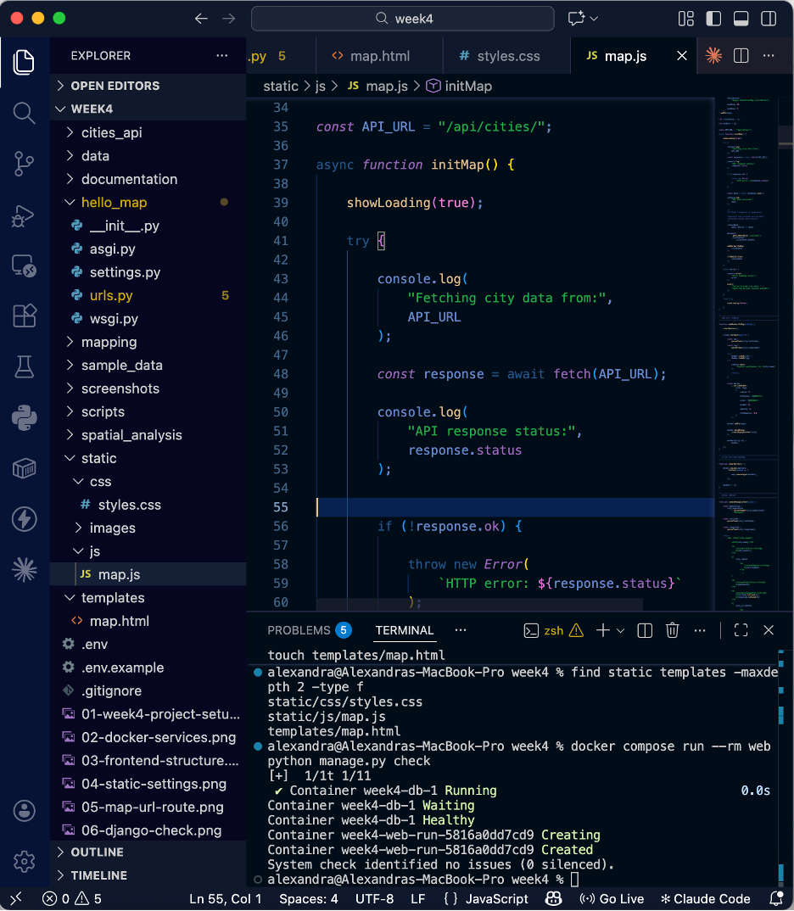

---

## 10. Cities API Verification

Before connecting the frontend to the map, the Week 3 Cities API was tested directly.

The endpoint:

```text
http://localhost:8000/api/cities/
```

returned:

```text
HTTP 200 OK
```

and:

```text
count: 20
```

The response contained city records such as:

- Paris
- London
- Madrid
- Barcelona
- Dublin
- Berlin
- Rome
- Vienna

This confirmed that the backend API was available for the Leaflet frontend.

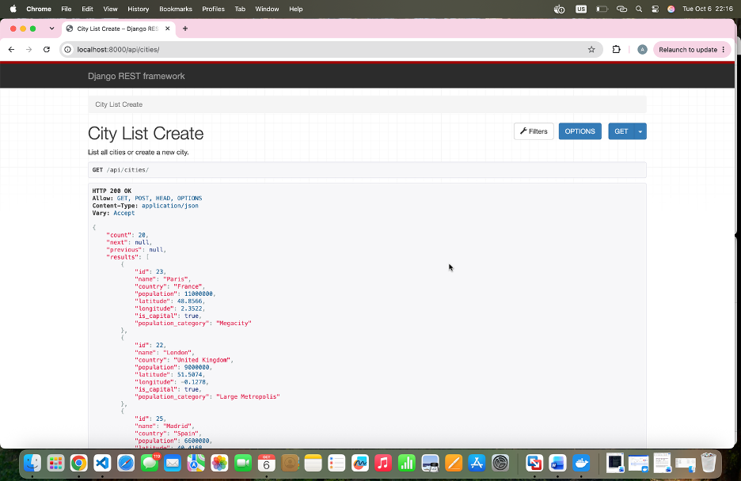

---

## 11. Static File Verification

Django static-file serving was tested directly in the browser.

The JavaScript file was accessible at:

```text
http://localhost:8000/static/js/map.js
```

The stylesheet was accessible at:

```text
http://localhost:8000/static/css/styles.css
```

Both files loaded successfully without a 404 error.

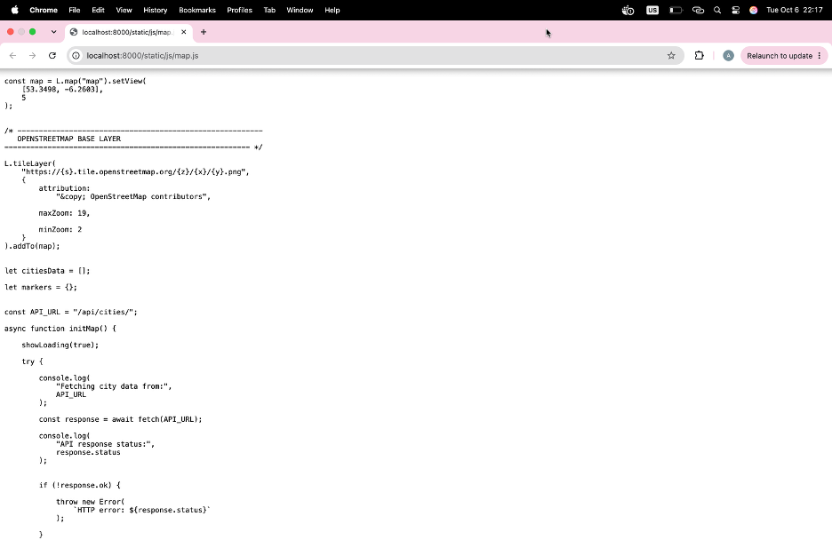

---

## 12. Interactive Leaflet Map

The completed map was accessed at:

```text
http://localhost:8000/map/
```

The application successfully displayed:

- a geographic basemap
- 20 city markers
- city search controls
- Reset View functionality
- city count information

The map automatically fitted the view to the available city data.

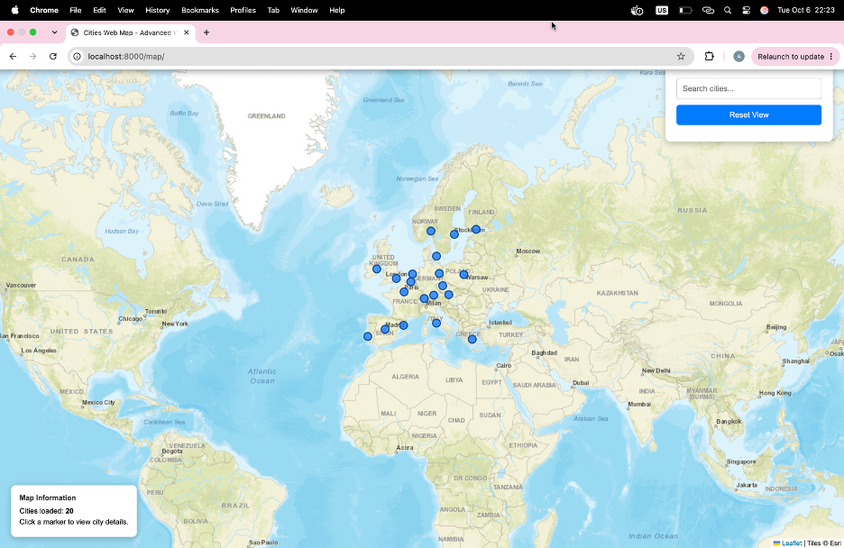

---

## 13. City Marker Popups

Each city is displayed as an interactive Leaflet circle marker.

Clicking a marker opens a popup containing city information.

Popup information includes:

- city name
- country
- region
- population
- coordinates
- capital status

This allows users to explore the API data directly from the map.

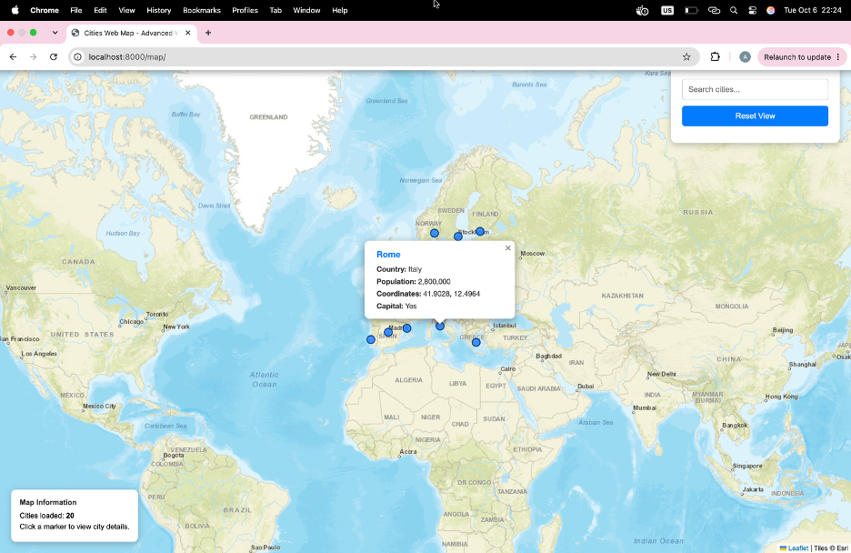

---

## 14. City Search Functionality

The city search field filters cities using either:

- city name
- country name

For example, searching for:

```text
Dublin
```

filters the map to Dublin and displays the matching search result.

Selecting the result moves the map to the city location.

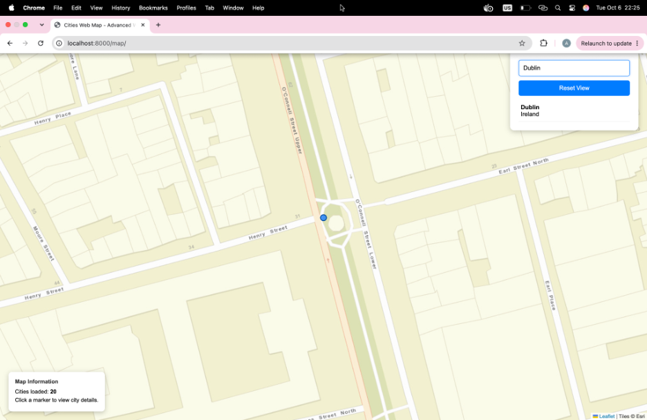

---

## 15. Frontend-Backend Communication

Chrome Developer Tools were used to verify communication between the Leaflet frontend and the Django REST API.

The browser console showed:

```text
Week 4 map.js loaded
DOM loaded. Starting map...
Fetching city data from: /api/cities/
API response status: 200
API data received: Object
```

This confirmed that:

- JavaScript loaded successfully
- the DOM initialized correctly
- the REST API request was successful
- city data was received by the frontend

The only browser warning was a missing favicon, which does not affect application functionality.

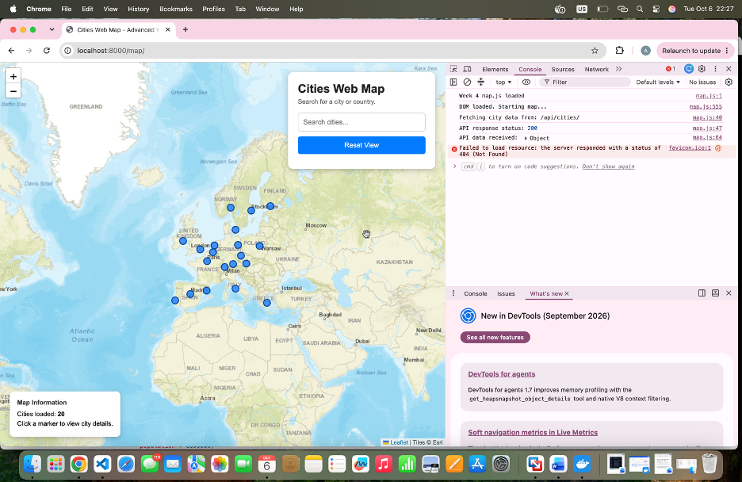

---

## 16. Automated Frontend Tests

Functional tests were created in:

```text
tests/test_frontend.py
```

The tests verify that:

- the map page loads successfully
- the `Cities Web Map` content is present
- Leaflet is included
- the search input exists
- the Reset View button exists
- the JavaScript static file is referenced
- the CSS static file is referenced

The test suite was run using:

```bash
docker compose run --rm web python manage.py test
```

The result was:

```text
Ran 3 tests in 0.006s

OK
```

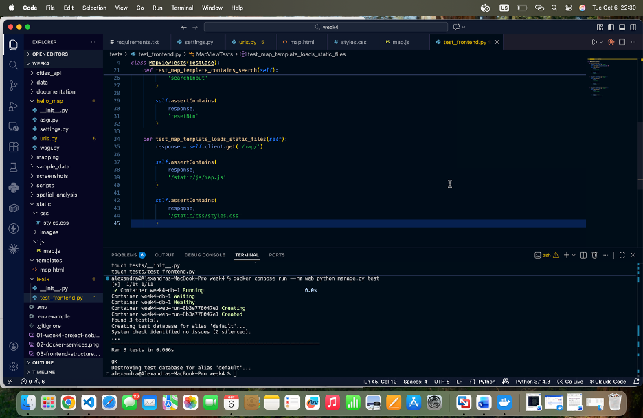

---

## 17. Responsive Design Testing

Chrome Developer Tools device emulation was used to test the application on a mobile-sized viewport.

The application remained usable on an iPhone-sized display.

The responsive version retained:

- the interactive map
- city markers
- the search panel
- Reset View
- city information

This confirmed that the responsive CSS rules were working correctly.

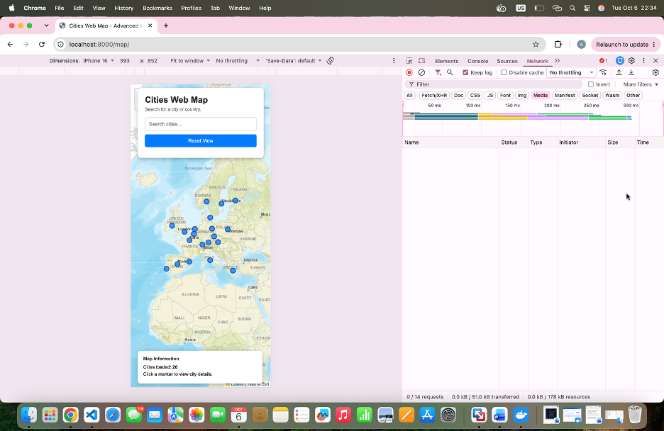

---

## 18. Network and Performance Testing

Chrome Developer Tools Network tab was used to inspect the API request.

The city API request returned:

```text
Status: 200
Type: fetch
Size: approximately 3.6 kB
Time: approximately 72 ms
```

The overall page load completed in under one second in the local Docker development environment.

This confirmed that frontend-backend communication was functioning efficiently for the sample dataset.

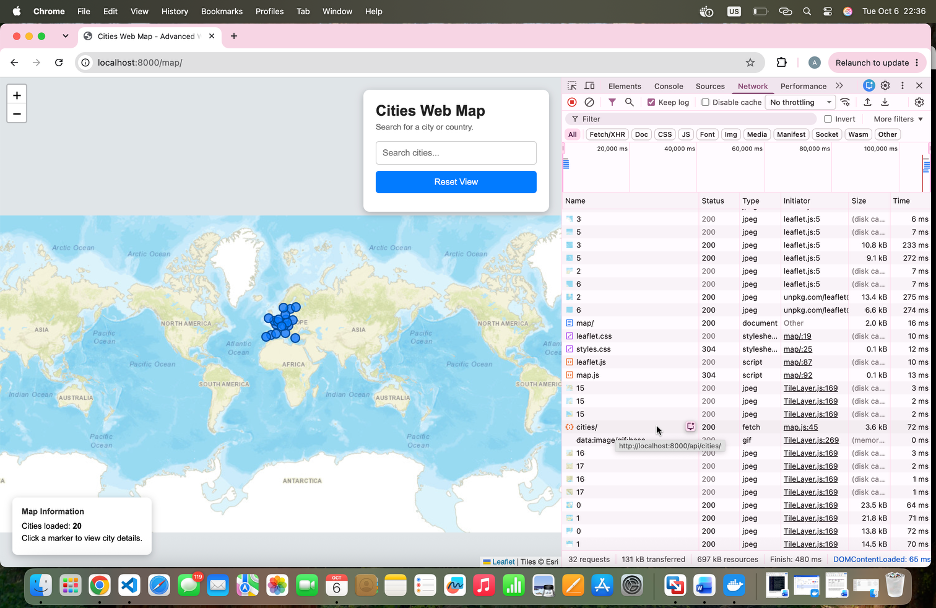

---

## 19. Database Migration Synchronisation

During validation, Django reported that the current `City` model contained a field change not yet represented in a migration.

A new migration was created:

```text
cities_api/migrations/0002_alter_city_founded_year.py
```

The migration was then applied successfully.

Verification showed:

```text
cities_api
 [X] 0001_initial
 [X] 0002_alter_city_founded_year
```

A final migration check reported:

```text
No changes detected
```

This confirmed that the Django models and database migration state were synchronized.

---

## 20. Final Validation

Final validation confirmed that:

- the PostGIS database was healthy
- pgAdmin was running
- Django was running
- the Cities API was working
- 20 city records were available
- the interactive Leaflet map was working
- static JavaScript and CSS files loaded correctly
- city markers were displayed
- city search worked
- Reset View worked
- responsive design worked
- the API returned HTTP 200
- all frontend tests passed
- Django reported no system-check issues
- no pending model migrations remained

The final test output included:

```text
Ran 3 tests in 0.006s

OK
```

and:

```text
System check identified no issues (0 silenced).
```

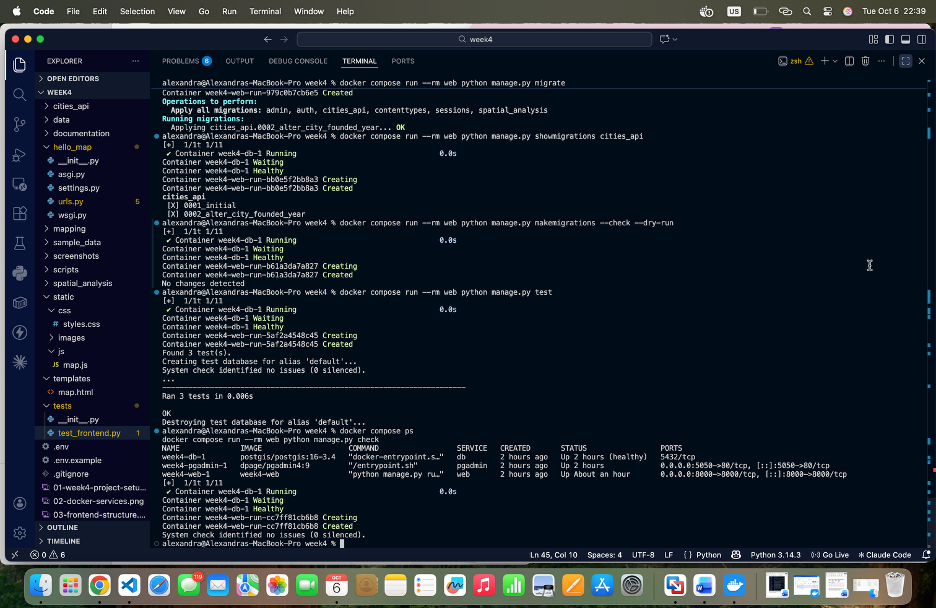

---

## Challenges Encountered and Solutions

### Missing Week 4 Environment File

When Week 4 was first started, Docker Compose reported that several environment variables were missing.

The Week 4 directory contained `.env.example`, but not the actual `.env` file.

The original Week 3 `.env` file was located in the previous Lab 3 project and copied into the Week 4 project.

This restored the database, Django and pgAdmin configuration.

The `.env` file remains excluded from Git.

---

### Missing Cities Database Table

The Cities API initially returned:

```text
ProgrammingError
relation "cities_api_city" does not exist
```

The Week 4 Docker environment was using a fresh database volume.

The database migrations and city loading command were therefore run.

The city loader successfully created:

```text
Created: 20 cities
Updated: 0 cities
Total: 20 cities in database
```

After this, the `/api/cities/` endpoint returned HTTP 200 successfully.

---

### OpenStreetMap Tile Access Error

The original OpenStreetMap tile URL returned:

```text
403 Access blocked
```

Although the city markers and API data were working, the background map tiles were unavailable.

The basemap was replaced with another Leaflet-compatible tile provider.

---

### Basemap API Key Error

A second attempted basemap returned an API key warning.

The application was then configured to use the Esri World Street Map tile service:

```javascript
L.tileLayer(
    "https://server.arcgisonline.com/ArcGIS/rest/services/World_Street_Map/MapServer/tile/{z}/{y}/{x}",
    {
        attribution: "Tiles &copy; Esri",
        maxZoom: 19
    }
).addTo(map);
```

This successfully displayed the geographic basemap.

---

### Pending City Model Migration

Django reported that the `cities_api` model contained a change to the `founded_year` field that was not represented by an existing migration.

The migration was created and applied:

```text
0002_alter_city_founded_year
```

A final dry-run migration check returned:

```text
No changes detected
```

---

## Technologies Used

- Python
- Django
- GeoDjango
- Django REST Framework
- PostgreSQL
- PostGIS
- Docker
- Docker Compose
- pgAdmin
- JavaScript
- Fetch API
- Leaflet.js
- HTML
- CSS
- Esri map tiles

---

## Key Features

The completed Week 4 application includes:

- interactive web mapping
- REST API integration
- AJAX / Fetch API communication
- dynamic city markers
- city information popups
- city search
- country search
- map navigation
- Reset View
- responsive layout
- browser console debugging
- network request validation
- automated frontend tests

---

## Future Enhancements

Possible future improvements include:

- marker clustering
- GeoJSON layer support
- city heatmaps
- multiple basemap options
- population-based marker sizes
- country filters
- capital-city filters
- map legends
- custom marker icons
- city detail pages
- user-selected spatial queries
- API authentication
- production static-file hosting
- improved caching

---

## Conclusion

Week 4 successfully connected the Week 3 Django REST API to an interactive Leaflet.js frontend.

The completed application demonstrates a full-stack web mapping workflow where:

- Django provides the web application
- Django REST Framework provides city data
- PostGIS stores geographic information
- JavaScript fetches the API data
- Leaflet displays the geographic data interactively
- users can search, navigate and inspect city information
- Docker provides a reproducible development environment

The result is a complete containerized web mapping application that combines backend spatial data with an interactive browser-based map.